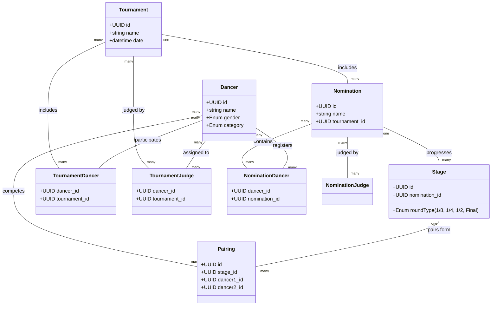

# This diagram is under development

```mermaid
classDiagram
%% Core Entities
    class Dancer {
        +UUID id
        +string name
        +Enum gender
        +Enum category
    }

    class Tournament {
        +UUID id
        +string name
        +datetime date
    }

    class Nomination {
        +UUID id
        +string name
        +UUID tournament_id
    }

    class Stage {
        +UUID id
        +Enum roundType (1/8, 1/4, 1/2, Final)
        +UUID nomination_id
    }

    class Pairing {
        +UUID id
        +UUID stage_id
        +UUID dancer1_id
        +UUID dancer2_id
    }

    %% Join Tables for M:N relationships
    class TournamentDancer {
        +UUID dancer_id
        +UUID tournament_id
    }

    class TournamentJudge {
        +UUID dancer_id
        +UUID tournament_id
    }

    class NominationDancer {
        +UUID dancer_id
        +UUID nomination_id
    }

    %% Relationships
    Dancer "many" -- "many" TournamentDancer : participates
    Tournament "many" -- "many" TournamentDancer : includes

    Dancer "many" -- "many" NominationDancer : registers
    Nomination "many" -- "many" NominationDancer : contains

    Tournament "one" -- "many" Nomination : includes
    Nomination "one" -- "many" Stage : progresses

    Dancer "many" -- "many" TournamentJudge : assigned to
    Tournament "many" -- "many" TournamentJudge : judged by

    Nomination "many" -- "many" NominationJudge : judged by

    Stage "one" -- "many" Pairing : pairs form
    Dancer "many" -- "many" Pairing : competes
```
